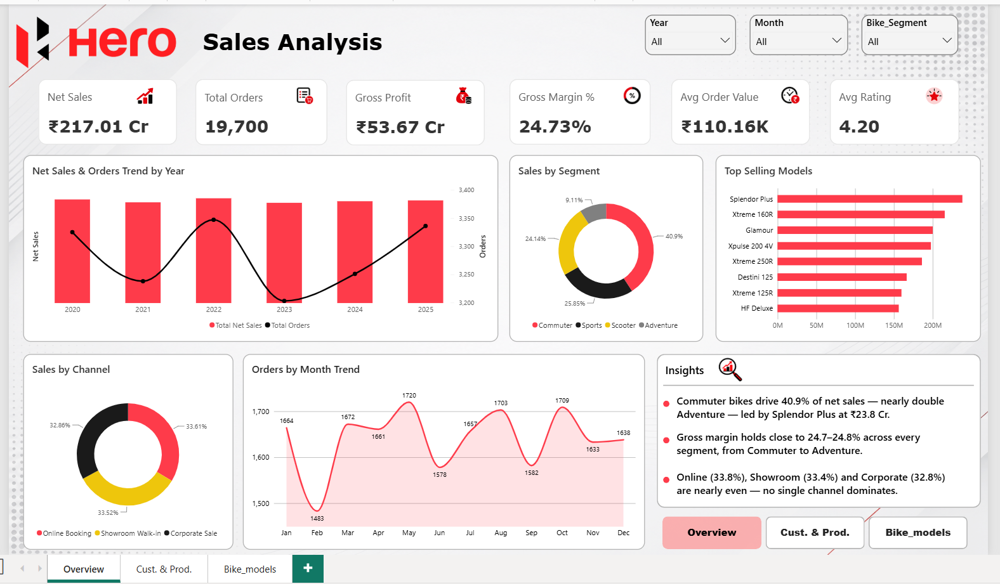
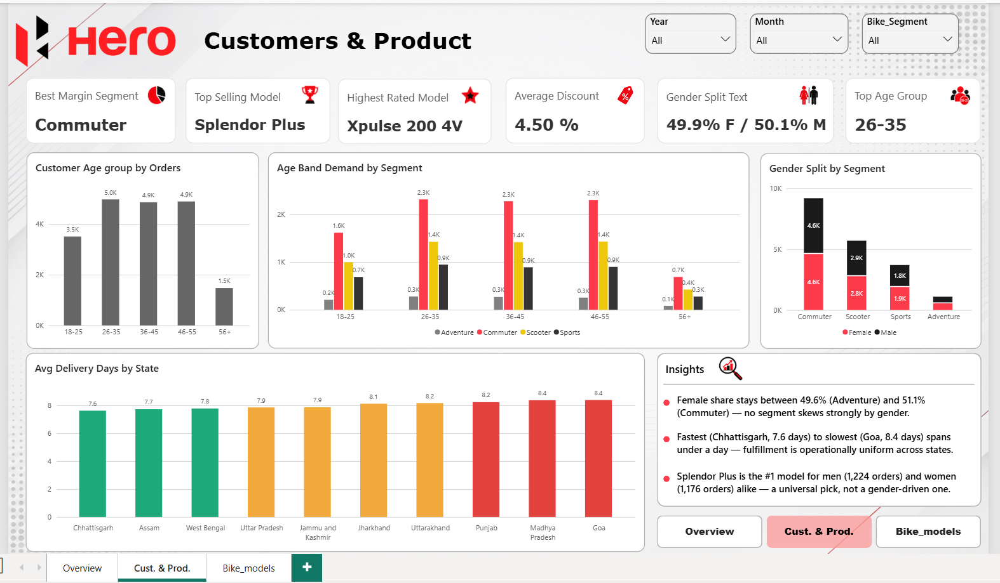
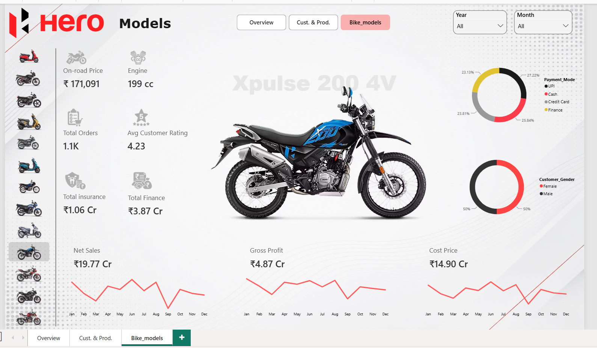

# 🏍️ Hero MotoCorp Sales Dashboard — Power BI

An end-to-end Power BI dashboard analyzing **19,700 retail bike sales orders** for Hero MotoCorp across India (2020–2025), covering sales performance, customer demographics, and model-level deep dives — built from a synthetically generated, realistic retail dataset.

---

## 📊 About the Project

This dashboard simulates a real-world two-wheeler retail analytics use case for **Hero MotoCorp**, one of India's largest motorcycle manufacturers. It answers key business questions across sales trends, customer behavior, and product/model performance — using a single, well-structured dataset and DAX-driven KPIs.

**Dataset:** `Hero_All_Dataset.csv`
- 19,700 orders | 2020–2025
- 28 columns spanning order details, dealer & location info, customer demographics, pricing, payments, and profitability
- Key fields: `Order_Date`, `State`, `City`, `Bike_Model`, `Bike_Segment`, `Sales_Channel`, `Payment_Mode`, `Customer_Age`, `Customer_Gender`, `On_Road_Price`, `Discount`, `Net_Sales_Amount`, `Cost_Price`, `Gross_Profit`, `Delivery_Days`, `Customer_Rating`
- Supplementary file: `Hero_bike_img.csv` — maps each bike model to a product image URL, used to render bike images dynamically on the Models page

**Tools used:** Power BI Desktop, DAX, Power Query

---

## 📄 Dashboard Pages

### 1️⃣ Sales Analysis (Overview)
The landing page — a high-level executive summary of overall business performance.

**Highlights:**
- KPI cards: Net Sales (₹217.01 Cr), Total Orders (19,700), Gross Profit (₹53.67 Cr), Gross Margin % (24.73%), Avg Order Value (₹110.16K), Avg Rating (4.20)
- Net Sales & Orders trend by year (2020–2025)
- Sales by Segment (Commuter, Sports, Scooter, Adventure)
- Top Selling Models ranked by net sales
- Sales by Channel (Online Booking, Showroom Walk-in, Corporate Sale)
- Orders by Month trend
- Auto-generated insights panel highlighting key takeaways

### 2️⃣ Customers & Product
A deep dive into customer demographics and how they interact with product segments.

**Highlights:**
- KPI cards: Best Margin Segment, Top Selling Model, Highest Rated Model, Average Discount, Gender Split, Top Age Group
- Customer age group distribution by orders
- Age band demand broken down by segment
- Gender split by segment
- Average delivery days by state
- Insights panel surfacing patterns in gender balance, delivery performance, and model popularity across genders

### 3️⃣ Bike Models
A model-selector page for exploring individual bike specs and performance.

**Highlights:**
- Scrollable model gallery (image thumbnails, powered by `Hero_bike_img.csv`)
- Selected model's on-road price, engine capacity, average rating, total orders
- Total insurance and total finance amounts for the model
- Payment mode split (Cash, Credit Card, UPI, Finance) and customer gender split
- Net Sales, Gross Profit, and Cost Price monthly trend lines for the selected model

---

## 🎛️ Filters

All three pages share consistent slicers for **Year**, **Month**, and **Bike_Segment**, allowing cross-page, synchronized filtering.

---

## 🗂️ Files in this Repository

| File | Description |
|---|---|
| `bike_dashboard.pbix` | Power BI dashboard file |
| `Hero_All_Dataset.csv` | Core sales dataset (19,700 orders) |
| `Hero_bike_img.csv` | Bike model → image URL mapping |
| `icons_image` | Icons used in KPI cards and Model Page |
| `Sales.png, Customers.png, Model2.png` | Dashboard page screenshots used in this README |

---

## 🚀 How to Use

1. Clone this repository
2. Open `bike_dashboard.pbix` in Power BI Desktop
3. If prompted, update the data source paths to point to the CSV files locally
4. Refresh the data model and explore

---

## 📌 Notes

- This is a portfolio/practice project built on a synthetically generated dataset modeled after real-world two-wheeler retail data — it is **not** official Hero MotoCorp sales data.
- Built to demonstrate skills in data modeling, DAX measure design, and multi-page interactive dashboard storytelling in Power BI.

---

## 👤 Author

**Siba Prasad Nayak**
🔗 [LinkedIn](https://www.linkedin.com/in/siba-prasad-nayak-86ab48362/)
